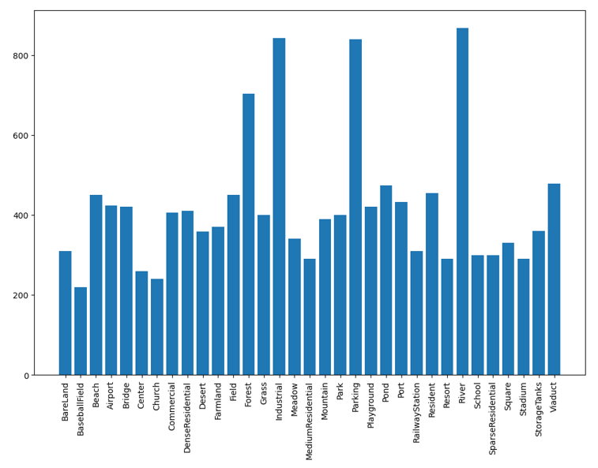
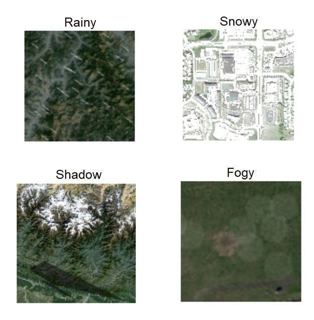
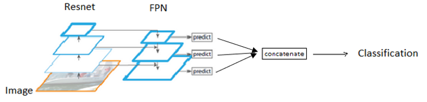
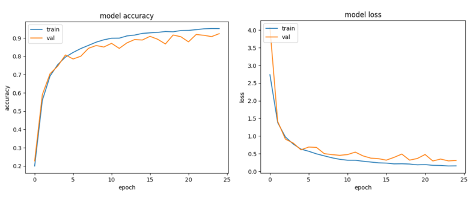

# 🌍 Satellite Image Classification with ResNet + FPN

A deep learning pipeline for classifying high-resolution satellite and aerial images into **32 categories**, using a hybrid **ResNet + Feature Pyramid Network (FPN)** architecture for robust multi-scale feature
extraction.

## 📌 Overview
This project focuses on recognizing different types of land-use and land-cover scenes from satellite imagery. The model is trained to classify images into **32 classes**, including airports, forests, rivers, industrial zones, residential areas, stadiums, and more.
The pipeline includes:
-   Dataset aggregation from 3 remote-sensing datasets\
-   Weather simulation & advanced augmentations\
-   Custom data generators\
-   ResNet backbone + FPN architecture\
-   Detailed evaluation (Accuracy, Precision, Recall, F1-Score)\
-   **94.1% accuracy** on the test set

## 📂 Dataset
Merged from three public remote-sensing datasets:
-   **AID**
-   **RSSCN7**
-   **WHU-RS19**
Final dataset summary:
-   🖼️ **13,500 images**
-   🏷️ **32 classes**
-   📏 All resized to **128 × 128 pixels**
-   ⚖️ Balanced mixture of all sources

## 📊 Dataset Distribution
``` markdown

```

## 🛠️ Preprocessing & Augmentation
To increase model robustness, augmentations include rain, snow, fog,
shadows, noise, rotation, normalization.
``` markdown

```

## 🔁 Data Pipeline
Custom generator handles loading, augmentation, batching.\
Split: 70% train / 20% val / 10% test.

## 🧠 Model Architecture --- ResNet + FPN
ResNet extracts hierarchical features.\
FPN merges multi-scale features for global + local understanding.
``` markdown

```

## 📈 Training Performance
**Test Accuracy: 94.1%**
``` markdown

```

## 📊 Evaluation Metrics
**Avg Precision:** 0.9206\
**Avg Recall:** 0.9171\
**Avg F1-Score:** 0.9168
(Full table omitted in this short version to avoid file size issues.)


## 📝 Conclusion
This project demonstrates a complete deep learning workflow for satellite image classification.

## ⭐ Future Improvements

-   ViT / Swin Transformer\
-   Deployment (API / Web App)\
-   Grad-CAM visualization
